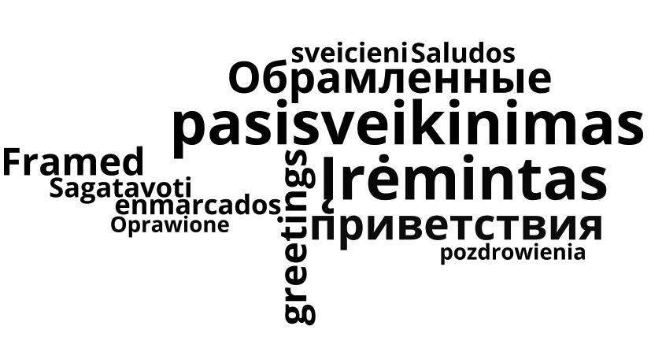

# 

![version][version-badge]

## Programos tikslas

**Programa atspausdina įrėmintą pasisveikiną sudarytą iš 5 eilučių:**
- Pirmoje eilutėje prasideda _rėmelis_, kuris yra seka * simbolių, ir kurio plotis priklauso nuo žmogaus vardo (įvesto programos vartotojo), pasisveikinimo ”Sveikas, ”, tarpo ir * simbolių pradžioje ir pabaigoje.
- Antroji eilutė prasideda ir baigiasi * simboliu, o vidus užpildytas reikiamu skaičiumi tarpo simbolių.
- Trečioji eilutė susideda iš *, tarpo, pasisveikinimo, tarpo ir vėl *.
- Kervirta ir penkta eilutės bus analogiškos antrąjai ir pirmąjąi.

## Programos išvedimas 

Įvedus vartotojo vardą **Remigijus** ir pageidautiną rėmelio dydį (nuo 1 iki 10) **3**, programos išvedimas (output'as) atrodo taip:

```shell
Koks Jūsų vardas: Remigijus
Įveskite rėmelio dydį (nuo 1 iki 10): 3

***************************
*                         *
*                         *
*                         *
*   Sveikas, Remigijus!   *
*                         *
*                         *
*                         *
***************************
```
## Įdiegimas (Unix kompiuteryje) naudojant `Clang`kompiliatorių 

- `git clone https://github.com/objprog/pasisveikinimas.git`
- `cd pasisveikinimas`
- `clang++ -std=c++11 pasisveikinimas.cpp -o pasisveikinimas`
- `./pasisveikinimas`

## Versijų istorija (changelog)

### [v1.0](https://github.com/objprog/pasisveikinimas/releases/tag/v1.0) - (2018-02-20)

**Pridėta**

- Atsirado galimybė kontroliuoti rėmelio dydį

**Koreguota**

- Atnaujintas **README** failas

### [v0.2.1](https://github.com/objprog/pasisveikinimas/releases/tag/v0.2.1) - (2018-02-12)

**Koreguota**

- Pataisytas .cpp failas

### [v0.2](https://github.com/objprog/pasisveikinimas/releases/tag/v0.2) - (2018-02-12)

**Pridėta**

- Papildyta programa taip, kad atpažįsta vartotojo lytį ir pagal ją pakoreguoja sveikinimo tekstą
- Programos logotipas

**Koreguota**

- Papildytas **README** failas

### [v0.1](https://github.com/objprog/pasisveikinimas/releases/tag/v0.1) - (2018-02-12)

***Pridėta***

- Pirminė programos versija

[version-badge]: https://img.shields.io/badge/version-1.0-blue.svg

